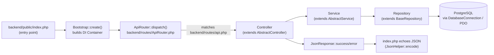

# CIDB Chatbot — Architecture Overview

## Summary

This document is a reference snapshot of how the cidb-chatbot codebase is structured — backend request flow, session state machine, migration system, and the frontend single-page chat widget. It exists to give context for feature docs (like `docs/faq-search-feature.md` and `docs/faq-feedback-assistance-form.md`) without repeating the same background in every one of them.

## Backend

### Request flow

- **`backend/bootstrap/Bootstrap.php`** builds a DI `Container` (`backend/bootstrap/Container.php`): loads `.env` via `Configuration`, registers `DatabaseConnection`, `Logger`, `ErrorHandler`, `MigrationManager`, storage/OCR services as lazy factories. Unregistered classes (most controllers/services/repositories) are auto-resolved via reflection/constructor autowiring.
- **`backend/routes/api.php`** is a plain array of `{method, path, controller, action}` route definitions, with `{param}` placeholders. `ApiRouter::dispatch()` matches method+path, resolves the controller from the container, and invokes the action.
- **Controllers** (`backend/controllers/`, extend `AbstractController.php`) parse payload/route params/files and delegate to services — no business logic lives here.
- **Services** (`backend/services/`, most extend `AbstractService.php`) hold business logic, wrap DB writes in `transactional()` (begin/commit/rollback), call validators and repositories.
- **Repositories** (`backend/repositories/`, all extend `BaseRepository.php`) run parameterized SQL via `DatabaseConnection::pdo()`. `BaseRepository` provides generic, injection-guarded methods — `findById`, `findByUUID`, `findAll`, `paginate`, `filter`, `search` (`ILIKE` across columns), `searchCount`, `count`, `findOneBy`, `insert`/`update` (both use `RETURNING *`), `delete` — plus transaction helpers and an `assertIdentifier` guard. Subclasses typically only implement `tableName()` and add domain-specific finder methods.
- Errors funnel through `AppException` and a global `ErrorHandler`.

### Controllers today

| Controller | Responsibility |
|---|---|
| `SessionController` | Drives the multi-step chat session (language, service type, state, name, identity, mobile, email, company-* fields, faq topic/subtopic, show). |
| `FaqController` | FAQ browsing: topics, subtopics, questions, search. |
| `DocumentController` | Document upload (IC/passport, etc.). |
| `SignatureController` | Signature image upload. |
| `SubmissionController` | Final submission of a service request and lookup by id. |

### Session state machine

- **`backend/validators/SessionValidator.php`** defines `ALLOWED_STATUS`, `ALLOWED_STEPS` (const arrays), and a `stepTransitions` map enforcing legal next steps per flow (individual / company / FAQ).
- **`backend/services/SessionService.php`** implements one method per step (`saveLanguage`, `saveServiceSelection`, `saveName`, ..., `saveFaqTopicSelection`, `saveFaqSubtopicSelection`). Each: loads the session, calls `assertStep()` against `SessionValidator::isTransitionAllowed`, validates input, decodes `draft_payload` JSON, merges the new field, re-encodes, persists via the repository, and writes an `AuditService::record()` entry — all inside `AbstractService::transactional()`.
- **`draft_payload`** (JSONB column on `chatbot_sessions`) is the accumulating "form state" for the whole conversation until final submission — every flow (individual, company, FAQ) stores its own fields under this same generic mechanism, not dedicated columns.

### Migrations

- Files named `YYYYMMDD_description.php` in `backend/migrations/`, implementing `MigrationInterface` (usually via `AbstractMigration.php`).
- `MigrationManager.php` discovers files matching `^\d{8}_`, sorts them, and skips already-applied ones.
- `MigrationExecutor.php` ensures a `migration_history` table exists, runs each migration's `up($pdo)` inside a transaction, and records name/batch/elapsed time.
- **Migrations do not auto-run on any request path** — nothing in the codebase calls `MigrationManager::runPending()` automatically; they must be applied manually.
- FAQ precedent: `20260819_add_faq_flow.php` (creates `reference_faq_topics` / `reference_faq_subtopics` / `chatbot_faq_questions`, and alters `chatbot_sessions`'s `ck_chatbot_sessions_status` / `ck_chatbot_sessions_current_step` CHECK constraints to add FAQ values) + `20260820_seed_real_faq_content.php` (data-only reseed).

## Frontend (`frontend_api.js` + `home.html`)

Single vanilla-JS file (no framework/bundler), loaded from `home.html`'s only `<script>` tag.

- **`API_BASE_URL`** (line 2) + `apiUrl()`/`normalizeApiBaseUrl` build request URLs; **`apiRequest(path, options)`** (line 605) is the central `fetch` wrapper — JSON or FormData bodies, throws on non-2xx or `success === false`; **`extractData(payload)`** unwraps `payload.data` / nested `payload.payload.data`.
- **`state`** (module-level object, lines 57–86) is the single source of truth, driven by `state.step` (a string state-machine id). Holds session id, language, service type, all collected form fields (individual: `name`, `identityType`/`identityNumber`, `mobile`, `email`, `stateName`; company: `companyName`, `companyPpkNumber`, `companyEmail`, `companyDirectorName`, `companyDirectorIdentityType`/`Number`, `companyReason`), FAQ browsing state (`faqTopics`, `faqTopicCode`, `faqSubtopics`, `faqSubtopicCode`, `faqQuestionOffset`), uploads/signature, and submission/request info.
- **`handleStep(text)`** (line 1235) is the big dispatcher — one `if (state.step === '...')` block per step; each validates input, calls `apiRequest`, updates `state`, appends messages via `addMsg()`, sets quick replies via `setQR()`, and transitions `state.step`.
- **`addMsg(html, type)`** (line 447) appends a chat bubble via `innerHTML` — full HTML (including buttons with inline `onclick`) is supported, which is how FAQ results and quick replies already render.
- **`setQR(opts)`** (line 477) replaces the quick-reply buttons; clicking one sets the input value to the button label and calls `sendMessage()` — quick replies are just typed-text shortcuts under the hood.
- Flows: **individual** (`ask_state → ask_name → ask_ic → ask_mobile → ask_email → ask_ic_copy → submit`), **company** (`ask_company_ppk → ... → ask_company_reason → ask_ic_copy → submit`), **FAQ** (`ask_faq_topic → ask_faq_subtopic → question list`, plus the free-text search fallback documented in `docs/faq-search-feature.md`).
- There is no dedicated "end conversation" step function — the existing pattern (used at the end of `submitIC()`, ~line 2307) is simply `state.step = 'done'; setInput(false);` after an `addMsg()` closing message.
- **`home.html`** is a single chat widget: `#chatMessages` (target for `addMsg`), `#userInput`/`#sendBtn`, `#quickReplies` (populated by `setQR`), plus upload-slot and signature-modal DOM elements referenced by ID from `frontend_api.js`.

## Related docs

- `docs/faq-search-feature.md` — free-text FAQ search fallback.
- `docs/faq-flow-db-diagnostic.md` — FAQ schema/migration diagnostic investigation.
- `docs/faq-feedback-assistance-form.md` — FAQ answer feedback + Assistance Form escalation (this session's change).
