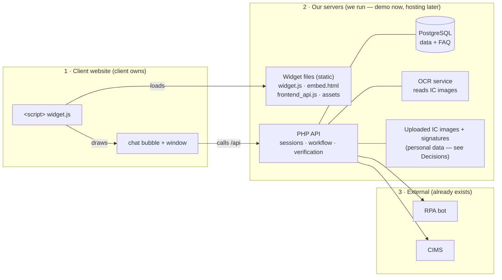
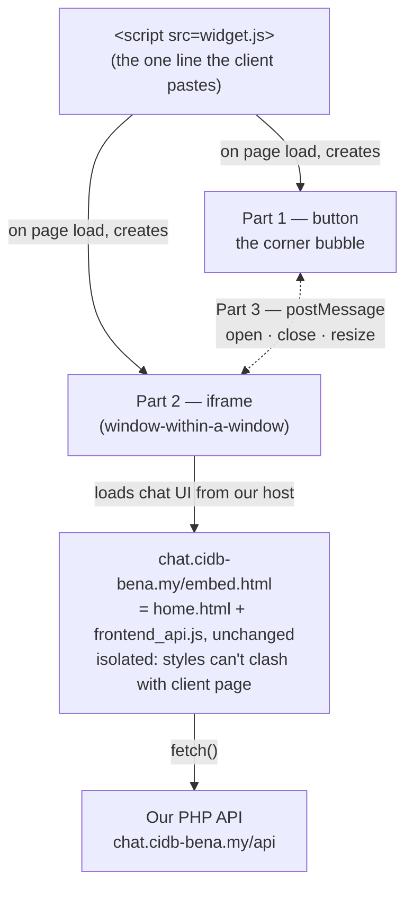

# Embeddable Widget — Delivery Model

## Status

Proposal / not yet built. Written to support a demo now and a client rollout later.
The companion visual brief (diagrams, boss-facing talking points) lives outside the
repo as a standalone HTML document.

## Summary

Deliver the chatbot to a client site as a single `<script>` tag — the same install
model as Google Analytics, Intercom, Zendesk, Tawk.to. The client pastes one line and a
chat bubble appears on every page. The chat UI, the PHP API, PostgreSQL, and the OCR
service all run on infrastructure **we** operate; the client's site only ever holds the
snippet.

```html
<!-- paste once, just before </body> -->
<script
  src="https://chat.cidb-bena.my/widget.js"
  data-workflow="CIDB_EMAIL_ID_CANCELLATION"
  data-lang="en"
  async></script>
```

## Which part lives where



The client installs zone 1 only — one line that draws a bubble. Zones 2 and 3 are
servers and services the client never touches.

**Why the client side is so thin:** anything that needs a database, a language runtime,
secrets, or CIMS access cannot run in a browser. The only part that can travel in a
snippet is the UI — and even that is *loaded from our server*, not copied into the
client's site.

## How one line becomes a chat window

Every embeddable widget uses the same three-part pattern.



1. **Loader script** (`widget.js`, ~50 lines) — creates the launcher button, reads
   settings from its own `<script>` tag's `data-*` attributes, injects the iframe on
   click. No chat logic itself.
2. **iframe** — a sandboxed sub-window pointing at a URL we host. Runs today's
   `home.html` + `frontend_api.js` essentially as-is. Gives style/JS isolation, update
   control (change our server, every embed updates on next load), and a security boundary.
3. **postMessage** — a narrow message channel carrying `open` / `close` / `height` events
   between the loader and the iframe. That is the entire contract.

Two open-source references to model `widget.js` on: **Chatwoot** (`sdk.js`) and
**Typebot** (`@typebot.io/js`).

## Snippet vs. hosted — full list

| Component | What it does | Where it lives |
|---|---|---|
| `home.html` / `embed.html` / `frontend_api.js` / `assets/` | Chat interface — runs in the browser | Our static host (loaded into the iframe) |
| `widget.js` | ~50-line loader (bubble + iframe) | Our static host — the file the snippet points at |
| PHP JSON API (`backend/public/index.php`) | Sessions, workflow steps, verification | Our app server |
| PostgreSQL | Session state, FAQ content, verification results | Our database |
| OCR service (`ocr/` — Python / PaddleX) | Reads uploaded IC images | Our app server |
| RPA bot & CIMS | Ticket insertion, identity checks | External (already separate) |
| Uploaded IC images & signatures | Personal data captured in the flow | Our storage — see Decisions |

## Step-by-step build

Steps 1–3 are the snippet (~2–3 engineer-days). Steps 4–5 are hosting. Step 6 is testing.

### Step 1 — make the front end configurable

`frontend_api.js` lines 1–3. Two hard-coded values become inputs:

```js
// today
const API_BASE_URL = 'http://localhost:8000';
const WORKFLOW_CODE = 'CIDB_EMAIL_ID_CANCELLATION';

// after: read from the iframe URL, with safe fallbacks
const p = new URLSearchParams(location.search);
const API_BASE_URL = p.get('api')      || location.origin;
const WORKFLOW_CODE = p.get('workflow') || 'CIDB_EMAIL_ID_CANCELLATION';
const START_LANG   = p.get('lang')     || 'en';
```

Also set `DEBUG_RPA_FLOW` (line 30) to `false` for the hosted build.

### Step 2 — create `embed.html`

A thin copy of `home.html` sized to fill an iframe: transparent background, no page
margins. Loads the same `frontend_api.js` and styles. Layout wrapper, not a rewrite.
Keep `home.html` for standalone testing.

### Step 3 — write `widget.js`

```js
(function () {
  var me   = document.currentScript;
  var host = "https://chat.cidb-bena.my";
  var qs   = "?api=" + encodeURIComponent(host)
           + "&workflow=" + (me.dataset.workflow || "")
           + "&lang=" + (me.dataset.lang || "en");

  // 1 — launcher button
  var btn = document.createElement("button");
  btn.textContent = "Chat";
  btn.setAttribute("aria-label", "Open chat");
  btn.style.cssText = "position:fixed;bottom:20px;right:20px;z-index:2147483000";
  document.body.appendChild(btn);

  // 2 — the iframe, hidden until first click
  var frame = document.createElement("iframe");
  frame.src = host + "/embed.html" + qs;
  frame.title = "Bena chat";
  frame.style.cssText = "position:fixed;bottom:88px;right:20px;width:380px;"
                      + "height:600px;border:0;display:none;z-index:2147483000";
  document.body.appendChild(frame);
  btn.onclick = function () {
    frame.style.display = frame.style.display === "none" ? "block" : "none";
  };

  // 3 — let the chat resize / close itself
  window.addEventListener("message", function (e) {
    if (e.origin !== host) return;               // only trust our iframe
    if (e.data.type === "bena:close")  frame.style.display = "none";
    if (e.data.type === "bena:height") frame.style.height = e.data.px + "px";
  });
})();
```

Production version adds mobile full-screen sizing, an X icon, and an unread dot. Inside
`embed.html`, add the other half: a `window.parent.postMessage(...)` on resize and one
on the close button.

### Step 4 — host the backend

- Run `backend/` behind nginx + PHP-FPM on one server / container.
- Provision PostgreSQL; run every migration in `backend/migrations/` — script this into
  deploy (manual today).
- Run the OCR service as a long-lived container on the private network.
- Move all secrets to environment variables. **Do not ship the committed `.env.example`**
  — it contains a live-looking `RPA_BOT_API_KEY` (line 31). Rotate that key.

### Step 5 — host the static widget files

Put `widget.js`, `embed.html`, `frontend_api.js`, `assets/` behind
`chat.cidb-bena.my`. Serving the API from the **same** domain makes the chat's calls
same-origin — no CORS to configure. If split, the backend already reads an allow-list
from the environment (`backend/public/index.php` lines 15–51):

```
CORS_ALLOWED_ORIGINS=https://chat.cidb-bena.my
```

The client's own domain never goes in this list — calls come from our iframe, not their page.

### Step 6 — test end to end

- Serve a throwaway page with the snippet from a *different* origin
  (`python -m http.server`). Confirm the bubble appears, the window opens, and a full run
  — upload, signature, submit — completes with no console errors.
- Confirm `data-workflow` / `data-lang` reach `frontend_api.js`.
- Embed in a page with a strict `Content-Security-Policy`; note which directives the
  client must add.
- Check mobile: iframe should go full-screen below ~480px wide.

## What "demo hosting" means right now

Target: **steps 1–3 plus a minimal step 5**, pointed at the backend already running on
staging. No new infrastructure, no production hardening.

- **Backend:** keep the existing staging server. No change.
- **Static files:** any static host (S3 bucket, Netlify drop) or served by the staging box.
- **Domain:** a subdomain like `demo-chat.…` with automatic TLS.
- **Skip for now:** rate limiting, data-retention policy, client-hosted Docker bundle,
  CDN caching rules.

Output: a live URL where the snippet works on a real third-party page. Nothing in the
demo build is throwaway — going to a real client is the same `widget.js` / `embed.html`
repointed at a hardened backend.

## Alternative: client-hosted

Only if the client's policy forbids IC images / personal data leaving their
infrastructure. Ship a `docker-compose.yml` bundling nginx + PHP-FPM + PostgreSQL + OCR
plus the static files; the client runs `docker compose up` and operates the stack (their
server, TLS, DB backups, RPA/CIMS routing). This is a real deployment, not a "snippet" —
pursue only when data residency leaves no choice.

## Decisions before a real client

- **Personal data / PDPA** — the flow collects IC images and signatures. Whoever hosts
  the backend owns the data-protection responsibility. Decide storage location,
  retention, access, and which entity is data controller in the client contract.
- **Client-side CSP** — a strict `Content-Security-Policy` on the client's site needs our
  domain added to `script-src` and `frame-src`. The one change a client may need beyond
  pasting the snippet.
- **Committed secret** — `.env.example` line 31 carries a live-looking `RPA_BOT_API_KEY`.
  Rotate and move to a secret manager before anything is public.
- **RPA endpoint reachability** — `.env.example` line 30 is a hard-coded IP; the hosted
  backend must reach it, firewalled to known sources.
- **Abuse protection** — per-IP rate limit on `/session/*` and `/faq/search`; request
  size limits (uploads already capped at 10 MB).
- **Versioning** — serving `widget.js` from our host lets us push updates without the
  client changing anything, but we then own backward compatibility with older embeds.

## Recommended next step

Approve the 2–3 day snippet build (steps 1–3) against the staging backend, producing a
working embed on a real external page. Production hosting and data-handling decisions
come after the demo lands, scoped to a specific client.
