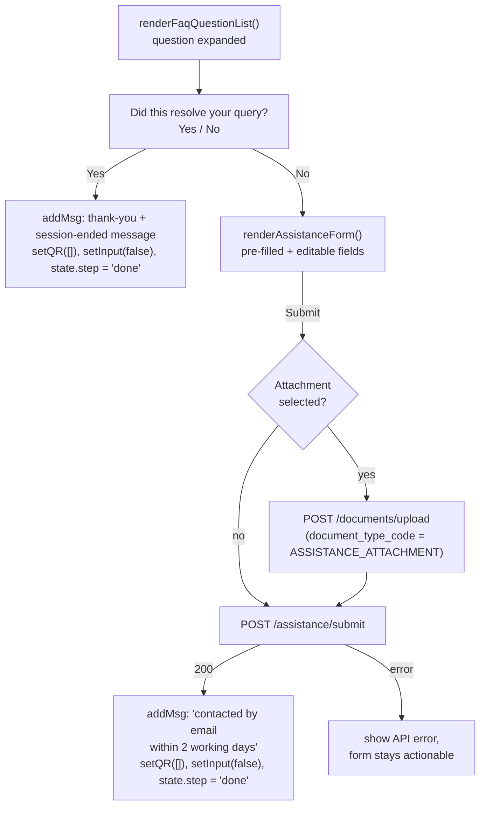

# FAQ Answer Feedback + Assistance Form

**Status:** Implemented on branch `feature/faq-flow-3`.

## Summary

Today, once a user expands an FAQ answer, the conversation just sits there — there's no way to tell whether the answer helped, and no path to escalate to a human if it didn't. This feature adds:

1. A **"Did this resolve your query?" Yes/No prompt** under every expanded FAQ answer (anywhere `renderFaqQuestionList()` is used — now only the `ask_faq_enquiry` search results).
2. **Yes** → the chat ends immediately with a thank-you message.
3. **No** (or the **"Submit an enquiry"** quick reply) → an **Assistance Form**, pre-filled from the basic details collected right after the user picked FAQ, that the customer completes and submits; on submit the chat ends with a "contacted by email within 2 working days" message.

> **2026-08-28:** the FAQ topic/subtopic menus were removed. The form is now reached
> via: pick FAQ → give basic details → type enquiry → search results → **No** /
> **Submit an enquiry**. See `docs/faq-search-feature.md`.

## Flow



**Key invariant**: like FAQ search, this is layered on top of the existing question-list rendering — it does not change how topics/subtopics/questions are fetched or displayed, and each expanded question gets its own independent Yes/No prompt (not a one-time-per-session prompt), since a customer may search or browse multiple times before deciding whether they need a human.

## Behavior

- **Trigger**: the Yes/No prompt renders automatically inside every `.faq-answer` block produced by `renderFaqQuestionList()` — no separate click is needed to reveal it.
- **Yes path**: display name is `state.serviceType === 'company' ? state.companyDirectorName : state.name`. Message (bilingual, matching `state.en`):
  > Thank you, [Customer Name], for using CIDB BENA Chat.
  > Your chat session has ended.
- **No path — Assistance Form fields**:
  - *Pre-filled, read-only* (sourced from state already collected earlier in the conversation — never re-asked): State, Customer Name (director name for company applicants), Applicant Category, Phone Number, Email Address, Enquiry Title (the FAQ question the user was viewing).
  - *User must enter*: Enquiry Description, MyKad/Passport No.
  - *User must enter, company applicants only*: Company Name, Company Registration No.
  - *Optional*: a single Supporting Documents attachment.
  - Submit button posts the form; on success the chat ends with the "contacted within 2 working days" message; on failure the form stays on screen so the user can retry.
- **State**: does not touch `state.step` until the conversation actually ends (`'done'`) — browsing/search position is irrelevant once feedback is given, since giving feedback always terminates the interaction one way or another.

## Database changes

### New table: `chatbot_assistance_requests`

No existing table fits this data: `service_requests` (used by the identity-verification submission flow, see `docs/architecture-overview.md`) is schema- and lifecycle-bound to OCR/CIMS verification and RPA status tracking, and has no free-text enquiry/description column. Rather than force this unrelated escalation flow through that table (and its CHECK-constrained `status`/`latest_cims_status` lifecycle), this feature adds one small dedicated table — the same "one feature, one table" pattern the FAQ tables (`reference_faq_topics`, `reference_faq_subtopics`, `chatbot_faq_questions`) already established in `20260819_add_faq_flow.php`.

New migration: **`backend/migrations/20260821_add_assistance_form.php`**

```sql
CREATE TABLE chatbot_assistance_requests (
    id                      UUID PRIMARY KEY DEFAULT gen_random_uuid(),
    session_id              UUID NOT NULL REFERENCES chatbot_sessions(id),
    state                   VARCHAR(100) NOT NULL,
    customer_name           VARCHAR(255) NOT NULL,
    applicant_category      VARCHAR(20)  NOT NULL CHECK (applicant_category IN ('individual', 'company')),
    phone                   VARCHAR(30)  NOT NULL,
    email                   VARCHAR(255) NOT NULL,
    enquiry_title           TEXT         NOT NULL,
    enquiry_description     TEXT         NOT NULL,
    id_number               VARCHAR(30)  NOT NULL,
    company_name            VARCHAR(255),
    company_registration_no VARCHAR(60),
    attachment_document_id  UUID REFERENCES uploaded_documents(id),
    status                  VARCHAR(20)  NOT NULL DEFAULT 'new',
    created_at              TIMESTAMPTZ  NOT NULL DEFAULT now(),
    updated_at              TIMESTAMPTZ  NOT NULL DEFAULT now()
);

CREATE INDEX idx_chatbot_assistance_requests_session_id ON chatbot_assistance_requests(session_id);
```

**`20260829_add_form_fields_to_assistance_requests.php`** adds the case-classification
fields (fed to CIMS via the RPA bot) and two more attachment slots:

```sql
ALTER TABLE chatbot_assistance_requests
    ADD COLUMN cases_category           VARCHAR(100),   -- e.g. 'Pertanyaan'
    ADD COLUMN sub_category_1           VARCHAR(150),   -- e.g. 'Pendaftaran Kontraktor'
    ADD COLUMN sub_category_2           VARCHAR(200),   -- e.g. 'Prosedur pembaharuan PPK/SPKK/STB'
    ADD COLUMN attachment_document_id_2 UUID REFERENCES uploaded_documents(id),
    ADD COLUMN attachment_document_id_3 UUID REFERENCES uploaded_documents(id);
```

`cases_category` / `sub_category_1` / `sub_category_2` are **required** on submit
(422 if missing). Each currently has a single fixed dropdown option, and the value is
always stored as the **verbatim Bahasa Malaysia** CIMS string regardless of chat
language — the RPA bot matches these literally against CIMS dropdowns.

Also seeds a new row into the existing `reference_document_types` table (same `INSERT ... ON CONFLICT (document_type_code) DO NOTHING` pattern as `20260813_add_company_email_id_cancellation_flow.php`):

```sql
INSERT INTO reference_document_types (document_type_code, label_en, label_ms, is_active)
VALUES ('ASSISTANCE_ATTACHMENT', 'Supporting Document', 'Dokumen Sokongan', true)
ON CONFLICT (document_type_code) DO NOTHING;
```

**What this does *not* touch:**
- No change to `chatbot_sessions` — no new `status`/`current_step` CHECK values, no `SessionValidator` changes. Unlike the FAQ topic/subtopic steps, this feature never needs to resume mid-flow after a page reload, so it doesn't need to be a tracked session step — it's a terminal action, always followed by `state.step = 'done'`.
- No change to `service_requests` or its lifecycle columns.
- `uploaded_documents` schema is unchanged; the attachment is just an ordinary row there, referenced by the new nullable FK.

### New repository

**`backend/repositories/ChatbotAssistanceRequestRepository.php`** — extends `BaseRepository`, `tableName()` → `chatbot_assistance_requests`, plus `findBySessionId(string $sessionId)`.

## API

```
POST /assistance/submit
```

Request body:
```json
{
  "session_id": "uuid",
  "state": "Selangor",
  "customer_name": "...",
  "applicant_category": "individual",
  "phone": "...",
  "email": "...",
  "enquiry_title": "How do I cancel my registration?",
  "enquiry_description": "...",
  "id_number": "...",
  "company_name": null,
  "company_registration_no": null,
  "cases_category": "Pertanyaan",
  "sub_category_1": "Pendaftaran Kontraktor",
  "sub_category_2": "Prosedur pembaharuan PPK/SPKK/STB",
  "attachment_document_id": "uuid | null",
  "attachment_document_id_2": "uuid | null",
  "attachment_document_id_3": "uuid | null"
}
```

Response (mirrors the existing `JsonResponse::success` shape used throughout the app):
```json
{
  "success": true,
  "message": "Assistance request submitted.",
  "data": { "id": "uuid", "status": "new", "created_at": "..." }
}
```

`company_name` / `company_registration_no` are required (400 validation error if missing) when `applicant_category === 'company'`, optional/ignored otherwise.

## Backend changes

| File | Change |
|---|---|
| `backend/migrations/20260821_add_assistance_form.php` | New — creates `chatbot_assistance_requests`, seeds `ASSISTANCE_ATTACHMENT` into `reference_document_types`. |
| `backend/repositories/ChatbotAssistanceRequestRepository.php` | New — `tableName()` + `findBySessionId()`. |
| `backend/services/AssistanceRequestService.php` | New — extends `AbstractService`; `submit(array $payload)` validates required/conditional fields, inserts inside `transactional()`, writes an `AuditService::record()` entry. No OCR/CIMS/RPA involvement (those services are only ever invoked from `SubmissionService`, not a global hook — see `docs/architecture-overview.md`). |
| `backend/controllers/AssistanceController.php` | New — thin wrapper, `submit(array $request)` → `AssistanceRequestService::submit()` → `JsonResponse::success()`. |
| `backend/routes/api.php` | Add `POST /assistance/submit` → `AssistanceController::submit`. |

## Frontend changes

File: `frontend_api.js`

- **`renderFaqQuestionList(questions)`** — each `.faq-answer` block gains a feedback section (`"Did this resolve your query?"` + Yes/No buttons) after the answer text. Question text needed for `enquiry_title` is kept in a small module-level lookup keyed by `answerId` (same lifecycle as the existing `faqAnswerIdCounter`), rather than inlined into the `onclick` attribute, to avoid HTML-escaping issues with quote characters in questions.
- **`handleFaqFeedback(resolved, answerId)`** — new. Yes: shows the closing message and ends the chat. No: sets `state.faqEnquiryTitle` and calls `renderAssistanceForm()`.
- **`renderAssistanceForm()`** — new. Renders the pre-filled/editable form described above via `addMsg()`, same inline-HTML pattern as `.faq-list`.
- **`submitAssistanceForm()`** — new. Client-side required-field validation, optional attachment upload via the existing `/documents/upload` endpoint, then `POST /assistance/submit`; ends the chat on success, shows an error and leaves the form active on failure.

No changes to `home.html` — the form renders inline into `#chatMessages` like every other bot message.

## Known limitations (v1)

- The Assistance Form supports exactly one optional attachment, not multiple files.
- No retry/resume: if the page is reloaded mid-form, the draft is lost (consistent with the rest of the chat, which is not persisted client-side either).
- The 2-working-day email commitment is not enforced or scheduled by this feature — it only records the request; following up is a manual/external process.

## Testing performed

Backend (via `POST` requests against the running PHP dev server, migration `20260821_add_assistance_form` applied):

- `POST /assistance/submit` with all fields for a **company** applicant → 200, row returned with `company_name`/`company_registration_no` populated.
- `POST /assistance/submit` for an **individual** applicant (no company fields sent) → 200, row returned with `company_name`/`company_registration_no` correctly `null`.
- `POST /assistance/submit` missing `enquiry_description` → 422 `ENQUIRY_DESCRIPTION_REQUIRED` with a field-level error, confirming required-field validation.
- `POST /documents/upload` with `document_type_code=ASSISTANCE_ATTACHMENT`:
  - a `.txt` file → 422 `FILE_UPLOAD_INVALID` (extension not in the allowed list), confirming the new `reference_document_types` row's MIME/extension policy is enforced.
  - a `.png` file → 201, returns an `uploaded_documents` row with `id`, which is the value `submitAssistanceForm()` sends as `attachment_document_id`.
- `php -l` syntax-checked on all new PHP files (migration, repository, service, controller, updated `routes/api.php`) — no errors.

Frontend:

- `node --check frontend_api.js` — no syntax errors.
- Not yet exercised end-to-end in a browser (click Yes/No, fill and submit the form via the UI) — recommended before sign-off.

Not yet covered: repeated question expansion showing independent feedback prompts, and the full Yes/No UI flow driven from the browser rather than direct API calls.
