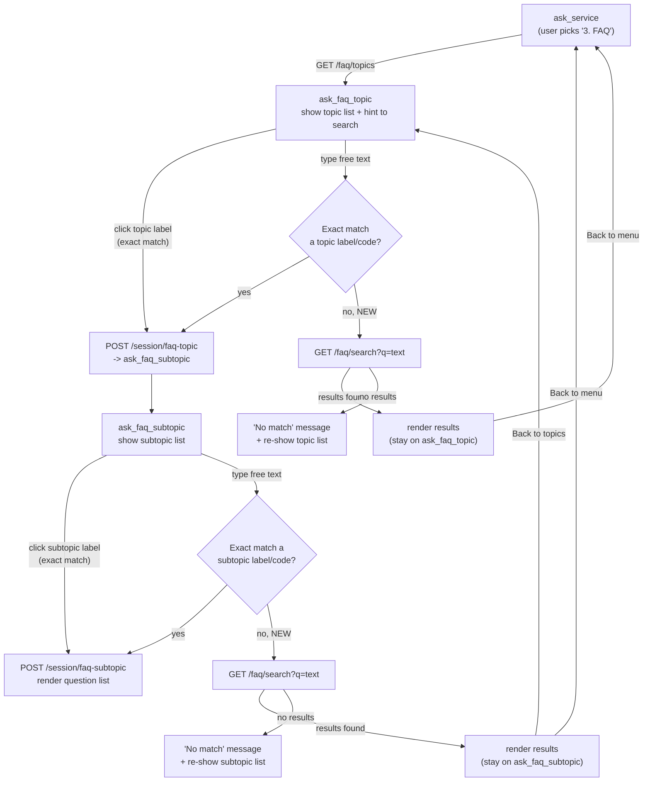

# FAQ Free-Text Search

## Changelog

- **2026-08-27** — Ranking overhaul (see *Ranking & scoping* below):
  - Topic-code filter (`PPK`/`SPKK`/`STB` in the query) now **narrows** results with `AND` instead of widening them with `OR`. Previously any query naming a topic returned every question in that topic regardless of the other keywords.
  - Keyword hits in the **question** columns score 3×; hits only in the **answer** columns score 1×. Stops rows that merely name-drop a term in their answer body from outranking on-topic questions.
  - When a query names a topic *and* carries other keywords, the bare topic token is dropped from the keyword list (the topic filter already scopes the document).
  - Free-text search now returns the **top 3** results (`FaqController::SEARCH_RESULT_LIMIT`), down from 10. The subtopic *browse* flow still pages 10 at a time — unchanged.
  - Tie-break added: `match_score DESC, char_length(question_en) ASC, sort_order ASC`.
- **2026-08-20** — Ranked keyword search + typo-tolerant `suggestions` fallback + topic-code detection (superseded the original plain-`ILIKE` v1 below).

## Summary

Users can now type a keyword or question at any point in the FAQ flow (topic step or subtopic step) and get matching FAQ questions directly, instead of being required to click through the Topic → Subtopic → Question menu. Clicking the quick-reply buttons still works exactly as before — this feature is a fallback for free text, not a replacement for the menu.

## Flow

The FAQ flow is a small state machine driven by `state.step` in `frontend_api.js`, dispatched from `handleStep()`. Before this change, `ask_faq_topic` and `ask_faq_subtopic` only accepted an exact (case-insensitive) match against a menu label/code — anything else was rejected as invalid. This change adds a search fallback at those two steps, without touching the entry point (`ask_service`) or the click-driven exact-match path.



**Key invariant**: a search never changes `state.step`, `state.faqTopicCode`, or `state.faqSubtopicCode`. It's a read-only detour — the user's position in the menu tree is exactly where they left it, so "Back to topics" / "Back to menu" still resolve correctly after a search.

## Behavior

- **Trigger**: search-on-submit. The user types into the existing chat input box and presses Enter/Send, same as every other step in the flow. There is no live-as-you-type autocomplete.
- **Scope**: always global. Typing a query searches the entire FAQ knowledge base (`chatbot_faq_questions.question_en`, `question_ms`, `answer_en`, `answer_ms`) regardless of which topic/subtopic the user is currently browsing. Clicking a quick-reply always means "browse this menu"; typing always means "search everything."
- **Matching**: the raw term is tokenized into keywords (stopwords stripped, `FaqController::extractSearchKeywords`). Each keyword is matched case-insensitively (`ILIKE '%keyword%'`) against the bilingual question and answer columns and contributes to a relevance score; rows are returned best-first. See *Ranking & scoping*.
- **Result count**: free-text search returns at most 3 rows. Browsing a subtopic via the quick-reply menu still returns 10 per page with a "Next" button.
- **Fallback order**: when the user types free text at the topic or subtopic step, the system first tries an exact match against the current menu's labels/codes (existing behavior, unchanged). If that fails, it now falls back to a search query. If the search also returns no results, the user sees a "no match" message and is re-shown the current menu.
- **State**: a global search does not change `state.step`, `state.faqTopicCode`, or `state.faqSubtopicCode` — "Back to topics"/"Back to menu" continue to resolve to wherever the user actually was before searching.

## Ranking & scoping

`ChatbotFaqQuestionRepository::buildKeywordMatchSql()` builds the scoring and filtering SQL from the keyword list and the (optional) topic-code list.

**Score** — summed over all keywords, per row:

| Where the keyword appears | Points |
|---|---|
| `question_en` or `question_ms` | 3 |
| only in `answer_en` / `answer_ms` | 1 |
| not found | 0 |

`ORDER BY match_score DESC, char_length(question_en) ASC, sort_order ASC`. The length tie-break favours the shorter, more canonical phrasing (e.g. "What is PPK?" over a long scenario question) when scores are equal.

**Topic scoping** — `FaqController::extractSearchTopicCodes()` picks up bare `ppk` / `spkk` / `stb` tokens. When present:

- The query joins `reference_faq_subtopics` and adds `AND s.topic_code IN (...)` — results are restricted to that document. (This is `AND`. The pre-2026-08-27 code `OR`-ed it, so `s.topic_code IN (...)` alone satisfied the `WHERE` and every question in the topic came back.)
- If the query also has non-topic keywords, the topic token is removed from the keyword list by `extractSearchKeywords($term, $topicCodes)`. So "SPKK renewal fee" scores on `renewal` + `fee` within the SPKK document, instead of also scoring every PPK/STB answer that happens to contain the word "SPKK" (e.g. STB's "difference between PPK, SPKK and STB").
- If the topic token is the *only* keyword ("SPKK"), it is kept, so the search still returns SPKK questions whose text contains "SPKK".

**Zero-result fallback** — unchanged: `suggestClosestQuestions()` runs a Levenshtein pass and returns up to 3 "did you mean" rows, honouring the same topic scoping.

## Backend changes

| File | Change |
|---|---|
| `backend/repositories/BaseRepository.php` | Added `searchCount(array $columns, string $term, array $criteria = []): int` — a count-only counterpart to the existing `search()` method, using the same `ILIKE` pattern. |
| `backend/repositories/ChatbotFaqQuestionRepository.php` | Added `searchQuestions()` and `countSearchQuestions()`, both built on `BaseRepository::search()`/`searchCount()`, filtered to `is_active = true`, searching `question_en`, `question_ms`, `answer_en`, `answer_ms`. |
| `backend/controllers/FaqController.php` | Added `search(array $request)` action reading `q`/`offset` from the query string, returning `{ questions, total, has_more, suggestions }`. Empty/whitespace query returns an empty result rather than an error. `SEARCH_RESULT_LIMIT = 3` caps free-text results. `extractSearchKeywords()` takes the recognised topic codes and drops the bare topic token when other keywords are present. |
| `backend/routes/api.php` | Added `GET /faq/search`. |

### 2026-08-27 update

| File | Change |
|---|---|
| `backend/controllers/FaqController.php` | `SEARCH_RESULT_LIMIT` const (3); `search()` computes `$topicCodes` first, passes them to `extractSearchKeywords()`, and uses `SEARCH_RESULT_LIMIT` instead of `QUESTIONS_PER_PAGE`; `extractSearchKeywords(string $term, array $topicCodes = [])` strips the bare topic token when distinguishing keywords remain. |
| `backend/repositories/ChatbotFaqQuestionRepository.php` | `buildKeywordMatchSql()` rewritten: question hit = 3 pts / answer-only hit = 1 pt (`CASE` expression); topic filter joined with `AND` not `OR`; `searchQuestionsByKeywords()` `ORDER BY` gains `char_length(q.question_en) ASC` tie-break. |
| `frontend_api.js` | `faqSearchIntroMessage()` helper; shown before the result list on all three free-text search hit-paths (`routeRenewalQueryToFaq`, `ask_faq_topic`, `ask_faq_subtopic`), pointing users at the "No" feedback button when the top 3 don't fit. |

No database migration was needed — search uses plain Postgres `ILIKE`, consistent with the existing `ServiceRequestRepository::searchByRequestNumber()` pattern already in the codebase. No `pg_trgm`/full-text (`tsvector`) infrastructure was introduced.

### API

```
GET /faq/search?q={term}&offset={offset}
```

Response shape matches the existing `/faq/subtopics/{code}/questions` endpoint:
```json
{
  "success": true,
  "message": "FAQ search results retrieved.",
  "data": {
    "questions": [ { "id": "...", "question_en": "...", "question_ms": "...", "answer_en": "...", "answer_ms": "...", "subtopic_code": "...", "sort_order": 1, ... } ],
    "total": 33,
    "has_more": true,
    "suggestions": []
  }
}
```

`questions` holds at most 3 rows. `total` is the full count of rows matching the keywords (+ topic filter), so `has_more` is usually `true` on a broad query — the frontend does **not** page free-text search, it just shows the 3 and offers the feedback / "Back to menu" quick replies.

## Frontend changes

File: `frontend_api.js`

- **`searchFaqQuestions(term, offset = 0)`** — new helper calling `GET /faq/search`, reusing the existing `apiRequest()`/`extractData()` plumbing.
- **`ask_faq_topic` step**: when typed text doesn't match a topic label/code, the handler now calls `searchFaqQuestions()` before showing the "invalid topic" error. On a hit, results render via the existing `renderFaqQuestionList()` accordion UI with a single "Back to menu" quick reply.
- **`ask_faq_subtopic` step**: same fallback, offering both "Back to topics" and "Back to menu" (consistent with the existing subtopic-step quick replies).
- **Entry-point copy**: the initial FAQ topic prompt now reads *"Please choose an FAQ topic, or type a keyword to search directly:"* (and the Malay equivalent), to surface the new capability to users.
- **`faqSearchIntroMessage()`** (2026-08-27): a one-line preamble rendered above every free-text search result list — "Here are the closest matches… tap **No** under an answer to send us an enquiry." Sets the expectation that the list is short (3) and routes the unlucky user to the assistance form (which the existing "No" feedback button already opens via `handleFaqFeedback(false, …)`).

No changes were made to `home.html` — the chat input box was already enabled and visible throughout the FAQ flow, and search results reuse the existing `.faq-list`/`.faq-item` accordion styling.

## Known limitations

- Search results show question/answer text only — they don't carry the parent topic/subtopic label, since the result rows come from `chatbot_faq_questions` (the topic join, when present, only filters). A user searching from the topic step won't see which topic a result belongs to.
- Keyword matching is substring `ILIKE` per token. A misspelling inside a token ("cancle") won't match on the ranked path; it only surfaces via the zero-result `suggestions` (Levenshtein) fallback.
- Ranking has no phrase/word-boundary awareness — `ILIKE '%score%'` also matches "SCOREBOARD"-type substrings. Not an issue with the current content but worth knowing before adding rows.
- `total` / `has_more` still report the full match count, but free-text search is capped at 3 and the UI has no "load more" for it. The tail is intentionally unreachable — the design routes those users to the assistance form instead.
- Source-data mismatches: a few seeded Q&As carry the wrong certificate name in the answer vs. the question (e.g. SPKK "How do I download renewed SPKK certificate?" answered with "…certificate for PPK Renewal"). The 3× question weighting makes these rank correctly anyway, but they should be fixed in `backend/migrations/data/faq_content.php`. See the overlap analysis for the full list.

## Testing performed

### 2026-08-27 (ranking overhaul) — live `GET /faq/search` against local backend

- `q=SPKK renewal fee` → 3 rows, all `SPKK_*` subtopics, top row "How much is the processing fee?" (`match_score` 4). Pre-fix this returned every SPKK question.
- `q=STB bumiputera shareholding` → 3 rows, all `STB_REQUIREMENTS`, `match_score` 6.
- `q=difference between PPK SPKK STB` → 1 row, `STB_GENERAL` "What is the difference between PPK, SPKK and STB?" (all three topic codes recognised → filter spans all three).
- `q=renew all three at once` → no topic code; ranked keyword fallback returns 3 sensible rows out of 154 matches.
- `php -l` clean on both changed PHP files.

### Original (v1)

- `GET /faq/search?q=cancel` → 200, returns matching rows across multiple subtopics with correct `total`/`has_more`.
- `GET /faq/search?q=zzzznomatch` → 200, `questions: []`, `total: 0`.
- `GET /faq/search?q=` (empty) → 200, `questions: []`, no error.
- Existing quick-reply click flow (topic → subtopic → question) unaffected — exact-match path is unchanged and checked first.

## Not yet done / follow-ups

- **Fix the mismatched seed Q&As** in `faq_content.php` (list in the PPK/SPKK/STB overlap analysis).
- **Consider a denormalised `topic_code` (or curated `keywords`) column** on `chatbot_faq_questions` so routing never depends on prose — would also simplify `suggestClosestQuestions()`'s `rowMatchesTopicCodes()` string handling.
- **Show the parent topic label** on each search result row (needs the subtopic join to return `s.topic_code` / label).
