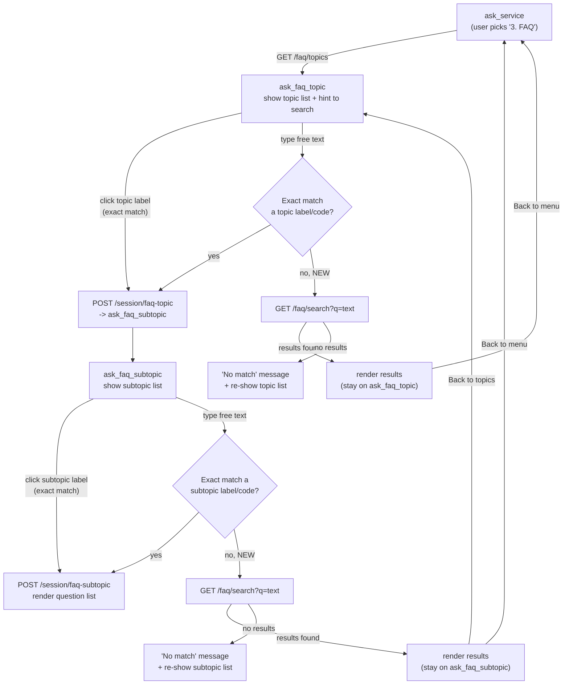

# FAQ Free-Text Search

## Summary

Users can now type a keyword or question at any point in the FAQ flow (topic step or subtopic step) and get matching FAQ questions directly, instead of being required to click through the Topic → Subtopic → Question menu. Clicking the quick-reply buttons still works exactly as before — this feature is a fallback for free text, not a replacement for the menu.

## Flow

The FAQ flow is a small state machine driven by `state.step` in `frontend_api.js`, dispatched from `handleStep()`. Before this change, `ask_faq_topic` and `ask_faq_subtopic` only accepted an exact (case-insensitive) match against a menu label/code — anything else was rejected as invalid. This change adds a search fallback at those two steps, without touching the entry point (`ask_service`) or the click-driven exact-match path.



**Key invariant**: a search never changes `state.step`, `state.faqTopicCode`, or `state.faqSubtopicCode`. It's a read-only detour — the user's position in the menu tree is exactly where they left it, so "Back to topics" / "Back to menu" still resolve correctly after a search.

## Behavior

- **Trigger**: search-on-submit. The user types into the existing chat input box and presses Enter/Send, same as every other step in the flow. There is no live-as-you-type autocomplete.
- **Scope**: always global. Typing a query searches the entire FAQ knowledge base (`chatbot_faq_questions.question_en`, `question_ms`, `answer_en`, `answer_ms`) regardless of which topic/subtopic the user is currently browsing. Clicking a quick-reply always means "browse this menu"; typing always means "search everything."
- **Matching**: case-insensitive substring match (`ILIKE '%term%'`) across all four bilingual text columns — not a fuzzy or ranked full-text search.
- **Fallback order**: when the user types free text at the topic or subtopic step, the system first tries an exact match against the current menu's labels/codes (existing behavior, unchanged). If that fails, it now falls back to a search query. If the search also returns no results, the user sees a "no match" message and is re-shown the current menu.
- **State**: a global search does not change `state.step`, `state.faqTopicCode`, or `state.faqSubtopicCode` — "Back to topics"/"Back to menu" continue to resolve to wherever the user actually was before searching.

## Backend changes

| File | Change |
|---|---|
| `backend/repositories/BaseRepository.php` | Added `searchCount(array $columns, string $term, array $criteria = []): int` — a count-only counterpart to the existing `search()` method, using the same `ILIKE` pattern. |
| `backend/repositories/ChatbotFaqQuestionRepository.php` | Added `searchQuestions()` and `countSearchQuestions()`, both built on `BaseRepository::search()`/`searchCount()`, filtered to `is_active = true`, searching `question_en`, `question_ms`, `answer_en`, `answer_ms`. |
| `backend/controllers/FaqController.php` | Added `search(array $request)` action reading `q`/`offset` from the query string, returning `{ questions, total, has_more }`. Empty/whitespace query returns an empty result rather than an error. |
| `backend/routes/api.php` | Added `GET /faq/search`. |

No database migration was needed — search uses plain Postgres `ILIKE`, consistent with the existing `ServiceRequestRepository::searchByRequestNumber()` pattern already in the codebase. No `pg_trgm`/full-text (`tsvector`) infrastructure was introduced.

### API

```
GET /faq/search?q={term}&offset={offset}
```

Response shape matches the existing `/faq/subtopics/{code}/questions` endpoint:
```json
{
  "success": true,
  "message": "FAQ search results retrieved.",
  "data": {
    "questions": [ { "id": "...", "question_en": "...", "question_ms": "...", "answer_en": "...", "answer_ms": "...", "subtopic_code": "...", "sort_order": 1, ... } ],
    "total": 12,
    "has_more": true
  }
}
```

## Frontend changes

File: `frontend_api.js`

- **`searchFaqQuestions(term, offset = 0)`** — new helper calling `GET /faq/search`, reusing the existing `apiRequest()`/`extractData()` plumbing.
- **`ask_faq_topic` step**: when typed text doesn't match a topic label/code, the handler now calls `searchFaqQuestions()` before showing the "invalid topic" error. On a hit, results render via the existing `renderFaqQuestionList()` accordion UI with a single "Back to menu" quick reply.
- **`ask_faq_subtopic` step**: same fallback, offering both "Back to topics" and "Back to menu" (consistent with the existing subtopic-step quick replies).
- **Entry-point copy**: the initial FAQ topic prompt now reads *"Please choose an FAQ topic, or type a keyword to search directly:"* (and the Malay equivalent), to surface the new capability to users.

No changes were made to `home.html` — the chat input box was already enabled and visible throughout the FAQ flow, and search results reuse the existing `.faq-list`/`.faq-item` accordion styling.

## Known limitations (v1)

- Search results show question/answer text only — they don't carry the parent topic/subtopic label, since the query only touches `chatbot_faq_questions` (no join). A user searching from the topic step won't see which topic a result belongs to.
- Matching is a plain substring `ILIKE`, not a ranked or typo-tolerant search — e.g. "cancle" (misspelled) won't match "cancel".
- Pagination (`offset`) is wired on the backend but not exposed in the UI yet — the frontend always requests `offset=0` and shows the first 10 results with no "load more" affordance for search results specifically (unlike the subtopic browse flow, which does have a "Next" button).

## Testing performed

- `GET /faq/search?q=cancel` → 200, returns matching rows across multiple subtopics with correct `total`/`has_more`.
- `GET /faq/search?q=zzzznomatch` → 200, `questions: []`, `total: 0`.
- `GET /faq/search?q=` (empty) → 200, `questions: []`, no error.
- Existing quick-reply click flow (topic → subtopic → question) unaffected — exact-match path is unchanged and checked first.
